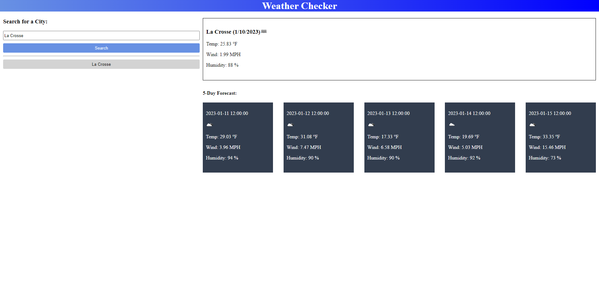

# Weather Checker

## Description

This simple weather app allows users to search for a city's current weather as well as the 5-day forecast. Previous searches will be stored to make it easy to access weather results. With this project, I learned how to incorporate multiple API calls to supply content to the webpage. 

## Website Screenshot

## Credits 
Thank you to [openweathermap.org](https://openweathermap.org/) for supplying the weather API.

## Published Website

https://dhoneck.github.io/weather-checker/